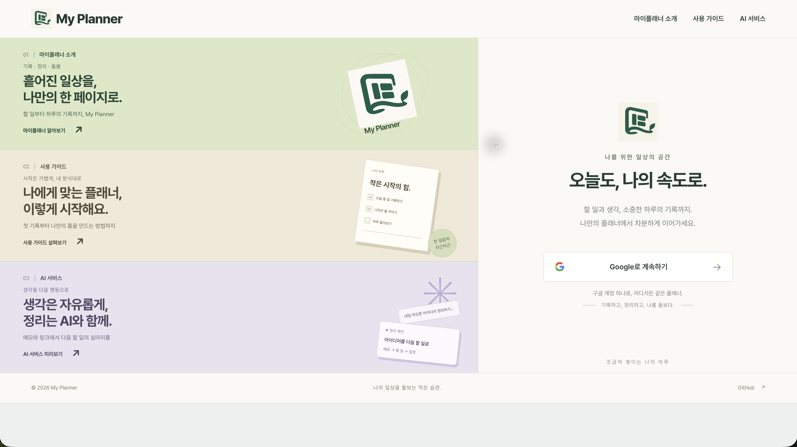
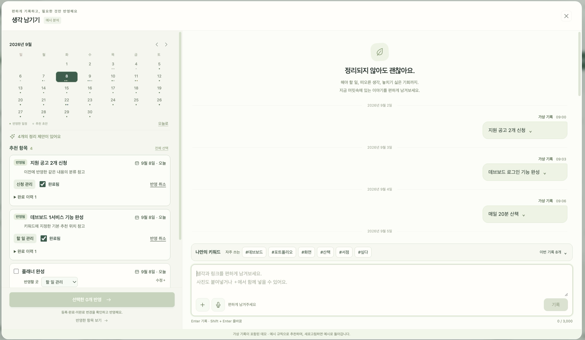
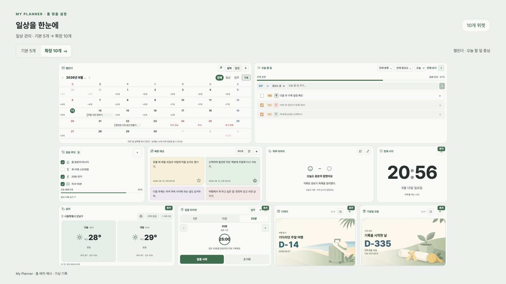

# my planner

**흩어진 할 일과 생각을 한곳에 모아, 나의 일상을 돌보는 개인 플래너.**

오늘 해야 할 일부터 일정, 목표, 습관, 하루의 기록까지. my planner에서 기록하고 정리하며 나에게 맞는 하루를 만들어 보세요.

  
  &nbsp;&nbsp;&nbsp;
  

  <a href="https://my-planner-487bd.web.app"><strong>마이플래너 시작하기</strong></a>

## 로고에 담은 마음

  

- **일상의 조각:** 여러 기록을 내 방식으로 모으고 정리합니다.
- **펼쳐 둔 일상:** 일상을 기록하고 필요할 때 다시 살펴봅니다.
- **일상의 돌봄:** 나의 일상을 살피고 돌봅니다.

통합 로고는 **기록하고 정리하며, 나의 일상을 돌보는 공간**을 뜻합니다.

<!-- 로고·QR·로고 설명은 상단에 유지합니다. 새 화면·기능 소개는 반드시 이 아래에 추가합니다. -->
<!-- PLANNER_SCREENSHOTS_START -->
## 화면으로 둘러보기

### 시작 화면

서비스 소개와 Google 로그인을 한 화면에서 만납니다.

### 생각 남기기 — AI 서비스 예시

자유롭게 기록하고, 정리 제안 중 필요한 항목을 선택하는 흐름입니다. **가상 기록과 예시 규칙을 사용한 데모**이며 실제 AI 분석 결과나 현재 제공 기능을 뜻하지 않습니다.

### 나만의 홈

시계·날씨·할 일·메모·목표·캘린더 등 필요한 정보를 모아 보는 홈 구성 예시입니다. 화면과 제공 위젯은 업데이트에 따라 달라질 수 있습니다.

[서비스 소개](https://my-planner-487bd.web.app/#about) · [사용 가이드](https://my-planner-487bd.web.app/#guide) · [AI 서비스 안내](https://my-planner-487bd.web.app/#ai)
<!-- PLANNER_SCREENSHOTS_END -->

디데이와 기념일 모음에 사용하는 부드러운 배경 일러스트 12장을 만들었습니다. [분류별 이미지 모음은 Wiki에서 확인하세요.](https://github.com/dbp-jack/my-planner/wiki/Reminder-Backgrounds)

## 내 하루에 필요한 것들을, 한 페이지에

| 이런 순간에 | 이렇게 사용해 보세요 |
| --- | --- |
| 해야 할 일이 머릿속에서 맴돌 때 | 오늘의 할 일과 빠른 메모에 바로 기록하기 |
| 일정과 목표가 흩어져 있을 때 | 캘린더와 목표·프로젝트에서 한곳에 정리하기 |
| 꾸준히 이어가고 싶은 일이 있을 때 | 습관을 기록하고 집중 타이머로 시작하기 |
| 하루를 돌아보고 싶을 때 | 저널과 하루 마무리로 생각과 경험 남기기 |

## 나에게 맞추는 홈

필요한 위젯을 골라 자주 확인할 정보와 바로 실행할 일을 나만의 홈에 모을 수 있습니다. 할 일, 메모, 캘린더, 목표, 집중 타이머 등으로 하루의 흐름을 구성해 보세요.

위젯에서 남긴 기록은 관련 페이지로 이어집니다. 같은 내용을 여러 곳에 다시 적는 부담을 줄이고 기록에서 실행과 회고까지 이어가는 것이 마이플래너가 지향하는 경험입니다.

## 가볍게 시작하는 세 단계

1. [마이플래너](https://my-planner-487bd.web.app)에 접속하고 Google 계정으로 로그인합니다.
2. 오늘 할 일이나 짧은 메모 하나를 남깁니다.
3. 자주 쓰는 위젯으로 홈을 꾸미고, 하루가 끝나면 기록을 돌아봅니다.

상세 사용 가이드는 준비 중입니다. 기능과 화면은 개선 과정에서 달라질 수 있습니다.

## AI와 함께하는 기록 — 준비 중

자유롭게 남긴 메모와 링크에서 핵심 정보를 찾고, 할 일과 일정으로 정리할 수 있도록 돕는 경험을 준비하고 있습니다. 제안된 내용은 사용자가 확인하고 선택하는 방향으로 검토합니다.

이 항목은 개발 방향에 대한 소개이며, 모든 기능의 현재 제공이나 출시 일정을 약속하는 안내는 아닙니다.

## 마이플래너 알리기

이 README 주소나 서비스 링크를 공유해 주세요. 상단 QR 코드로도 접속할 수 있습니다.

서비스에 대한 문의와 제안은 로그인 후 서비스 안의 문의 게시판을 이용해 주세요. 공개된 공간에는 개인 일정, 계정 정보와 같은 민감한 내용을 올리지 말아 주세요.

## 내부 소스 코드를 공개하지 않는 이유

이 저장소는 사용자가 my planner의 기능과 사용 방법을 알아보고 서비스 링크를 공유할 수 있도록 만든 **공개 소개용 저장소**입니다. 소개 README, 로고, 안내 이미지와 QR 코드를 제공합니다.

서비스의 자체 개발 코드와 구현 자산을 보호하고 운영 변경을 관리하기 위해, **내부 소스 코드와 운영 설정은 별도의 비공개 저장소에서 관리합니다.** 따라서 이 공개 저장소에는 내부 소스 코드나 서비스 실행·배포에 필요한 운영 설정을 포함하지 않습니다.

사용자는 소스 코드를 설치할 필요 없이 [마이플래너 서비스](https://my-planner-487bd.web.app)에 접속해 이용할 수 있습니다.

## 공개 범위와 권리 안내

© 2026 my planner. 저작권법에 따라 보호되는 문구·이미지 등 창작적 표현에 관한 권리는 각 권리자에게 있습니다. 이 저장소의 공개는 자료에 대한 포괄적인 복제·수정·재배포·상업적 이용 허락을 뜻하지 않습니다. 법령 및 GitHub 이용약관에서 허용하는 이용은 이에 영향을 받지 않습니다. 별도 이용이 필요한 경우 운영자에게 문의해 주세요.

여기에 표시된 서비스명과 로고는 서비스 식별을 위한 것이며, 이 안내는 상표권·디자인권 또는 특허의 출원·등록 완료를 주장하지 않습니다. 제3자 제품명과 표장에 관한 권리는 해당 권리자에게 있습니다.
