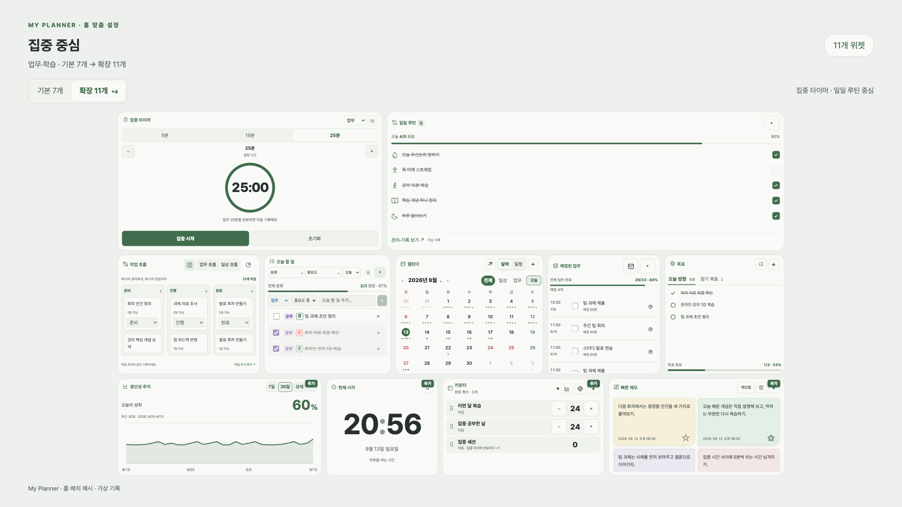
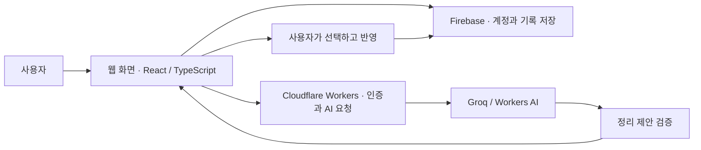

# My Planner

**나의 일상을 돌보는 공간 — 흩어진 할 일과 생각을 기록, 실행, 회고로 이어주는 개인 플래너.**

원티드 AI Championship 2026을 위한 프로젝트 소개입니다. 설치 없이 웹에서 사용할 수 있습니다.

  
  &nbsp;&nbsp;&nbsp;
  

  <a href="https://my-planner-487bd.web.app"><strong>서비스 시작하기</strong></a> ·
  <a href="https://my-planner-487bd.web.app/#tour">로그인 없이 둘러보기</a> ·
  <a href="https://my-planner-487bd.web.app/#guide">사용 가이드</a>

## 로고에 담은 마음

**나의 · 일상 · 돌봄.** 기록의 조각, 펼쳐 둔 페이지, 일상을 돌보는 잎이 하나의 공간으로 모입니다.

  

<!-- 로고·QR·로고 설명은 상단에 유지합니다. 새 화면·기능 소개는 이 아래에 추가합니다. -->

## 해결하고자 한 문제

할 일은 메모에, 약속은 캘린더에, 목표와 지원 일정은 또 다른 곳에 흩어집니다. 적어 놓았어도 다시 찾고 옮겨 적느라 정작 오늘 할 일을 놓치기 쉽습니다.

My Planner는 **한 번 남긴 기록을 필요한 화면에서 다시 확인하고 실행하는 흐름**을 만듭니다. 처음부터 모든 기능을 익히기보다, 오늘 할 일 하나를 적고 자주 보는 위젯을 홈에 놓는 것부터 시작합니다.

| 일상에서 생기는 어려움 | My Planner에서 하는 일 |
| --- | --- |
| 무엇부터 정리할지 모르겠어요 | 생각을 먼저 남기고 필요한 항목을 골라 정리합니다. |
| 일정과 할 일을 자꾸 놓쳐요 | 캘린더와 오늘 할 일을 홈에서 함께 확인합니다. |
| 계획이 실행으로 이어지지 않아요 | 할 일·루틴·목표·프로젝트와 집중 시간을 연결해 관리합니다. |
| 지나간 하루가 잘 기억나지 않아요 | 메모·일기·하루 마무리와 생산성 기록을 돌아봅니다. |

## 처음 사용하는 분을 위한 체험 순서

1. **[서비스](https://my-planner-487bd.web.app)를 열고 ‘처음 시작’을 누르세요.** 체험용 아이디와 비밀번호를 직접 만들어 ‘플래너 만들기’를 선택합니다. 개인 Google 계정 연동은 필요하지 않습니다. 다른 서비스와 다른 비밀번호를 사용하세요.
2. **안내된 접속 정보를 보관하고 홈을 선택하세요.** 원하는 색상과 사용 목적, 홈 구성을 고를 수 있습니다.
3. **오늘 할 일 하나를 적어 보세요.** ‘오늘 할 일’ 위젯에서 `책 10쪽 읽기`처럼 짧게 작성하고 완료 표시를 해 보세요. 캘린더에도 일정 하나를 추가해 보세요.
4. **나에게 맞게 홈을 꾸며 보세요.** 배치 편집에서 위젯을 추가·이동·크기 조절한 뒤 변경을 적용합니다. 모바일에서는 표시할 위젯과 순서를 고릅니다.
5. **생각 남기기도 사용해 보세요.** 짧은 글을 남기고 정리 제안을 확인한 뒤, 필요한 항목만 선택해 반영합니다. AI 제안의 날짜와 분류는 직접 확인하세요.

계정을 만들기 전에는 **‘로그인 없이 둘러보기’**로 가상 기록을 체험할 수 있습니다. 이 체험의 기록은 종료하면 삭제됩니다. 계정에서 기록을 이어 쓰려면 처음 만든 아이디로 로그인하세요.

실제 개인정보·회사 기밀·결제 정보 대신 체험용 내용을 사용해 주세요. 가입 방법은 심사위원과 일반 이용자 모두 같습니다.

## 화면으로 둘러보기

아래 홈 이미지는 **2026년 9월 13일 기준 홈 맞춤 설정의 가상 기록 예시**입니다. 개인 이용자의 실제 기록을 사용하지 않았으며, 선택한 구성과 화면 크기에 따라 배치가 달라집니다.

### 일상을 한눈에

캘린더·오늘 할 일을 중심으로 루틴, 메모, 하루 마무리와 기념일을 함께 확인합니다.

### 업무와 학습에 집중하기

같은 서비스에서도 집중 타이머·작업 흐름·목표를 중심으로 홈을 구성할 수 있습니다.

### 생각에서 실행으로

편하게 기록한 뒤 정리 제안을 검토하고, 필요한 항목만 선택합니다. 자동으로 모든 제안을 저장하거나 완료 처리하지 않습니다.

이 이미지는 **예시 규칙을 사용한 초기 인터페이스 데모**입니다. 실제 모델의 분석 결과나 정확도 증빙이 아닙니다. 현재 베타의 AI 연결과 제한은 다음 항목에 설명합니다.

[서비스 소개](https://my-planner-487bd.web.app/#about) · [사용 가이드](https://my-planner-487bd.web.app/#guide) · [AI 서비스 안내](https://my-planner-487bd.web.app/#ai)

## AI를 어떻게 활용했나요?

### 제작 과정

| 사용 도구 | 활용 방식과 결과 |
| --- | --- |
| OpenAI Codex | 요구사항을 정리하고 화면·저장 흐름을 구현하며, 오류 수정과 기능별 검증, 사용 안내 작성을 보조했습니다. 제작자가 실제 화면을 확인하고 수정 방향을 결정했습니다. |
| OpenAI 이미지 생성 | 홍보 배경과 안내용 시각 자산 제작에 활용했습니다. 홍보 GIF의 문구·배치·재생 시간·흩날림은 별도로 조정했습니다. |

### 서비스 안의 AI

| 기능 | 사용 도구 | AI의 역할과 사용자의 역할 |
| --- | --- | --- |
| 생각 남기기 | Groq의 `openai/gpt-oss-120b` · AI SDK · Zod | 입력한 글을 할 일·일정·메모 등의 후보로 정리합니다. 구조와 원문 근거를 검사한 제안을 사용자가 확인·수정·선택해 반영합니다. |
| 공개 공고 링크 정리 | Cloudflare Workers AI의 `@cf/qwen/qwen3.8-27b` | 공개된 공고의 본문과 지원하는 이미지를 읽어 주요 정보를 정리합니다. 읽기 실패나 불확실한 내용은 원문을 확인하고 직접 입력합니다. |

AI를 호출하는 서버와 기록을 저장하는 흐름을 분리했습니다. 생각 분석에는 이번 글과 관련 키워드·목표·프로젝트의 제한된 참고 정보만 전달하며, 과거 기록 전체나 첨부 이미지를 함께 보내지 않습니다. AI 출력은 제안이며, 기존 기록을 임의로 수정·삭제하지 않습니다.

**현재 베타의 체험 한도**

- 생각 분석: 사용자당 하루 3회, 전체 이용자 합계 하루 10회. 한국 시간 오전 9시에 초기화됩니다.
- 공고 Reader: 사용자당 하루 AI 분석 3회, 브라우저 읽기 1회, PDF 읽기 3회. 한국 시간 오전 9시에 초기화되며, 실행 경로에 따라 한도가 함께 차감될 수 있습니다.
- 실패한 실제 시도도 한도에 포함될 수 있습니다. 한도 도달이나 외부 서비스 오류 시 AI 체험이 제한되지만 기본 기록과 수동 정리는 이용할 수 있습니다.

AI 연결을 배포한 베타 버전이며, 모든 문장을 정확하게 해석하거나 모든 사이트를 읽는다고 보장하지 않습니다. 실제 판단과 최종 반영은 사용자가 합니다.

## 주요 기능과 구조

**17종의 홈 위젯** 중 필요한 기능을 선택합니다. 시계·날씨·할 일·메모·캘린더·루틴·집중 타이머·카운터·생산성 추이·목표·프로젝트·하루 마무리·예정된 업무·작업 흐름·저널 알림·디데이·기념일 모음이 있습니다. 저널 알림은 외부 피드이며, 직접 작성하는 일기와 구분됩니다.

웹 화면은 React·TypeScript·Vite, 계정과 저장은 Firebase Auth·Firestore, 웹 배포는 Firebase Hosting을 사용합니다. 외부 읽기·AI 요청은 Cloudflare Workers·Hono에서 처리합니다.

위젯과 상세 페이지가 같은 기록을 사용하도록 구성해 중복 입력을 줄였습니다. 기능별 화면과 저장 로직, AI 요청을 구분한 구조를 바탕으로 사용 목적별 홈 구성과 기록 연결을 발전시키려 합니다.

## 공개 범위와 문의

이 저장소는 **서비스 소개·이미지·체험 안내를 위한 공개 저장소**입니다. 내부 소스와 운영 설정, API 비밀키, 사용자 데이터는 포함하지 않습니다. 서비스를 사용하기 위해 코드를 설치할 필요는 없습니다.

[디데이·기념일 배경 이미지 모음](https://github.com/dbp-jack/my-planner/wiki/Reminder-Backgrounds)도 볼 수 있습니다. 문의와 제안은 서비스 안의 문의 게시판을 이용해 주세요.

© 2026 My Planner. 법령에 따라 보호되는 문구·이미지 등 창작적 표현의 권리는 각 권리자에게 있습니다. 공개가 자료 전반의 복제·수정·재배포·상업적 이용 허락을 뜻하지는 않습니다. 법령과 GitHub 이용약관상 허용되는 이용, 대회 참가약관에 따른 주최사의 심사·홍보 이용은 이에 영향을 받지 않습니다. AI 생성 부분의 권리 인정 범위는 관련 법령에 따릅니다. 서비스명·로고의 상표·디자인·특허 등록을 주장하지 않습니다.

---

안내 기준: 2026년 9월 13일. 이 README는 [원티드 AI Championship 2026](https://event.wanted.co.kr/ai-championship/2026)을 위한 소개 자료이며, 대회 사이트의 최종 과제 제출을 대신하지 않습니다.
